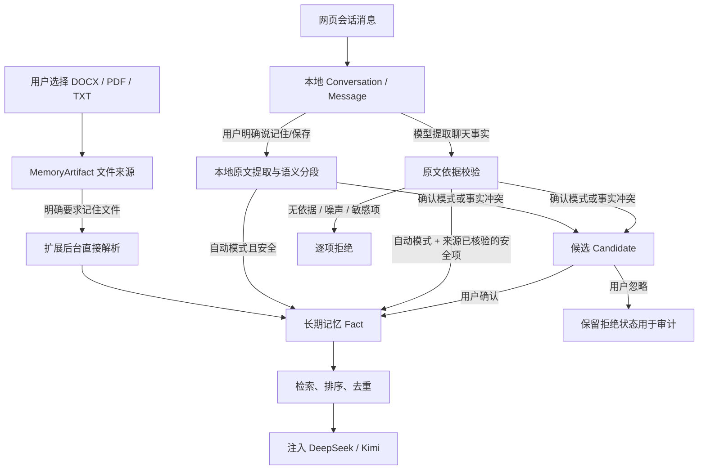

# OmniAgent 当前记忆逻辑

| 项目 | 当前实现 |
| --- | --- |
| 适用版本 | 当前扩展代码（Memory v2、IndexedDB v11） |
| 接入站点 | DeepSeek、Kimi |
| 文件记忆 | DOCX、PDF、TXT，单文件最大 20 MB |
| 默认设置 | 记忆注入开启；保存模式为“自动（安全）” |
| 存储位置 | 浏览器本地 IndexedDB，数据库名 `omni-agent` |

本文描述当前代码真正执行的完整流程。文件记忆、聊天记忆、本地会话和候选记忆是不同的数据通道，不能互相代替。

## 1. 数据分层



### 1.1 本地会话

网页中的用户消息和助手消息保存在 `conversations`、`messages` 表中。每累计 8 条消息还会生成一个 `sessionChunks` 摘要，供本地会话浏览和检索。它们不是长期记忆，不会因为出现在聊天里就自动成为 Fact。

### 1.2 文件来源（MemoryArtifact）

每个被选择的受支持文件先暂存为一条来源记录，包含：

- 文件 ID、文件名、MIME 类型、字节数和 SHA-256；
- Provider、页面会话 ID、页面会话对应的本地 conversation ID、项目 ID；
- `staged`、`imported` 或 `failed` 状态；
- 解析前的 Base64 文件内容、错误信息和导入时间。

文件成功或失败处理后会清除暂存的二进制内容。Fact 和 Evidence 只保存 `artifactId` 及页码、章节、题号等定位信息，不复制整个二进制文件。

### 1.3 长期记忆（Fact）

只有 `active` Fact 能参与检索。Fact 保存完整内容、摘要、类型、作用域、关键词、重要度、置信度、置顶状态、来源数量、访问次数、来源定位和修订信息。

| 类型 | 用途 |
| --- | --- |
| `profile` | 身份、人物关系、长期背景 |
| `preference` | 偏好和回答习惯 |
| `project` | 项目约束与技术上下文 |
| `procedure` | 稳定流程与操作规则 |
| `knowledge` | 可复用的知识、题目答案、清单、文件正文 |
| `episode` | 某次事件或阶段性结论 |

作用域包括 `global`、`provider` 和 `project`。全局 Fact 可跨 DeepSeek/Kimi 使用；Provider Fact 只用于指定站点；Project Fact 只用于当前项目。

### 1.4 候选记忆（Candidate）

候选不会注入模型。待处理页只展示 `pending` 和 `conflict`；确认后写入 Fact，忽略后标为 `rejected` 并从待处理页消失。候选 30 天未处理会变为 `expired`。候选和历史拒绝记录不会在启动时自动删除。

## 2. 文件记忆写入流程

### 2.1 暂存

内容脚本捕获网页文件输入框、拖拽和粘贴中的附件；开放 Shadow DOM 内的文件输入框也会被监听，发送前还会补扫一次当前文件输入。对 DOCX、PDF、TXT：

1. 检查扩展名和 20 MB 上限；
2. 读取字节并在页面端计算 SHA-256；
3. 将文件名、类型、大小、哈希和 Base64 字节发送给后台；
4. 后台重新解码、核对实际字节数并再次计算 SHA-256；
5. 校验通过后写入 `MemoryArtifact`，并绑定当前页面会话。

提示词拦截会等待当前文件暂存任务完成，避免用户选完文件立刻发送时出现“模型收到命令但后台还没有文件”的竞态。

文件保存意图可以跨一轮对话续接。用户先说“帮我记住这些考题”，当时尚未选择附件时，后台保存一条 30 分钟有效、绑定 Provider 与当前 conversation/pageSession 的待附件意图；随后用户只选择附件、没有再输入说明文字，暂存完成后也会直接导入。否定指令会取消该意图，过期意图不会触发写入，普通上传文件也不会因为存在附件而自动成为记忆。

### 2.2 明确导入

用户明确说“记住这个文件”“保存附件”“记住所有考题/答案”等内容时，扩展不再要求网页模型猜附件正文。后台查找当前页面会话中处于 `staged` 的文件并直接解析：

“我让你保存到记忆里，我会跨对话的”这类引用上一轮附件的明确指令，会优先消费当前会话中最近暂存的附件，不会再错误转入聊天 `memory.save_batch`。扩展或网页刷新导致随机 `pageSessionId` 改变时，后台会以同一个 Provider + conversation ID 恢复最近 30 分钟内的 `staged` 文件；扩展启动时也会恢复“同会话存在未撤销文件保存指令”的暂存文件，因此不要求用户重复上传。恢复只在同一会话内进行，不会扫描或导入其他标签页、其他会话的附件。

| 格式 | 解析内容 |
| --- | --- |
| DOCX | 标题、段落、自动编号列表、普通列表和表格 |
| PDF | 按页读取文本并保留起止页码；加密或无可提取文本的 PDF 返回错误 |
| TXT | 识别 UTF-8、UTF-16LE、UTF-16BE 并保留原文结构 |

文件 chunk 使用 `sourceKind = file_import`、`explicitUserIntent = true` 直接写入 Fact，不进入候选。敏感值检测仍逐段生效；一个段落被拒绝不会阻止其他合法段落写入。

文件已经由扩展处理后，注入给网页模型的提示只要求简短报告成功、拒绝和重复数量，禁止模型再次调用 `memory.save_batch`，从而避免同一附件被“扩展解析一次、模型猜测再存一次”。

### 2.3 文件去重

`MemoryArtifact.contentHash` 是唯一索引。相同 SHA-256 的文件再次选择时复用原来源记录，不重新创建 Fact；后台把它报告为重复文件。去重依据是文件字节，不依赖文件名。

### 2.4 语义分段

目标段长约 800 字，不是硬上限。解析器先生成语义单元，再组合 chunk：

- 优先在标题、段落、列表项、完整题目、句末或页边界分段；
- 题干、选项、答案与解析作为一个完整题目单元；
- 围栏代码块、表格行组和完整列表项不可从中间拆开；
- 单个语义单元超过 800 字时完整保留，绝不按第 800 个字符截断；
- 每个 chunk 保存文件名、页码范围、章节、题号和可读定位标签。

## 3. 聊天记忆写入流程

### 3.1 结构化批量工具

网页模型只能通过下面的结构提交聊天记忆：

```json
{
  "items": [
    {
      "content": "整理后的长期事实",
      "type": "knowledge",
      "importance": 0.8,
      "sourceQuotes": ["当前会话中的逐字原文"],
      "sourceMessageIds": ["对应的消息 ID"]
    }
  ]
}
```

`sourceQuotes` 和 `sourceMessageIds` 都必须是非空数组。`type` 只能是六种记忆类型，`importance` 必须是 0 到 1 的有限数。工具调用只返回保存、候选、拒绝数量及每项状态/拒绝原因，不回显大段正文。

### 3.2 原文依据验证

提示词会把近期会话消息及真实 `sourceMessageId` 提供给模型，但后台不会相信模型声明。每个 item 在进入 `MemoryService` 前独立执行：

1. 找到 item 引用的会话消息 ID；
2. 对消息和引用执行 Unicode NFKC、空白归一化；
3. 验证至少一条 `sourceQuote` 确实是该消息原文的连续片段；
4. 验证内容长度、类型、重要度和来源字段；
5. 拒绝思考过程、确认话术、记忆管理说明、页面状态和 OmniAgent 工具协议。

任何一步失败都只拒绝该 item，不创建 Fact，也不创建 Candidate；同批其他合法 item 继续处理。写入成功后，匹配到的逐字引用成为 Evidence 的 `excerpt`，详情页可以直接检查原文依据。

明确被拒绝的典型内容包括：

- “我在记忆中心看到 5 条”；
- “第一批已提交，待确认，请回复确认”；
- “思考过程：需要调用工具”；
- `<omniagent-action>`、`<omniagent-tool-result>` 及其 JSON；
- 模型关于“我将保存/继续处理”的过程说明。

这层验证是统一入口；不是在 Fact 写入后再扫描和清理错误记录。

### 3.3 明确保存与普通主动保存

| 情况 | 自动模式 | 确认模式 | 关闭模式 |
| --- | --- | --- | --- |
| 用户明确要求保存聊天内容 | 扩展先从用户原文直接写 Fact；事实冲突进入 Candidate；无法直接解析时才使用 `memory.save_batch` | 本地提取的合法条目进入 Candidate | 拒绝自动写入 |
| 模型在普通聊天中主动建议保存 | 原文核验通过的安全项直接写 Fact；冲突进入 Candidate | 合法条目进入 Candidate | 拒绝自动写入 |
| 用户在侧边栏手动添加、编辑或确认 | 直接执行人工操作 | 直接执行人工操作 | 直接执行人工操作 |

“明确要求”由扩展根据最近一条用户原话判断，模型不能自行声明。明确指令包括“记住”“保存到记忆”“写入记忆”“全部保存”等。扩展在用户消息进入本地会话后立即提取内联内容；“记住上面/以上内容”会取紧邻的上一条有效消息；文件命令即使提示注入失败，也会再次查找同会话暂存附件并直接导入。自动模式下，不敏感且无冲突的用户原文直接写入 Fact；同一事实的新旧值冲突时仍进入 Candidate。

模型仍可用 `memory.save_batch` 做结构化提取，但它不再是明确保存命令的唯一写入路径。后台保存真实结果后，会按助手消息 ID 把普通的“我记住了”或隐藏工具块原位替换为实际成功、待确认和拒绝数量；已经本地写入的请求不会再次执行模型生成的重复保存工具。

旧的“触发后 30 分钟自动抓取助手回复”以及固定字符截断逻辑已经移除。普通聊天事实仍必须经过模型结构化提取、原文校验和当前保存模式的写入策略；只有用户明确发出的保存命令使用上述本地原文兜底，不会把普通闲聊直接写成记忆。

## 4. 安全、去重与冲突

### 4.1 敏感信息

Token、API Key、密码、私钥等敏感值不允许由模型或文件流程自动写入。手动保存的敏感 Fact 也使用 `injectionPolicy = never`，不会进入模型上下文。

### 4.2 Fact 身份与结果

```text
identityKey = scopeKey | type | canonicalKey
scopeKey    = global | provider:<providerId> | project:<projectId>
```

| 情况 | 处理结果 |
| --- | --- |
| 身份键不存在 | 新建 Fact，并写 Evidence |
| 身份键和归一化内容相同 | 不建重复 Fact；增加来源证据和置信度 |
| 身份键相同但内容不同，允许人工修订 | 更新 Fact，并写 Revision |
| 身份键相同但内容不同，不允许自动修订 | 建立 `conflict` Candidate，原 Fact 不变 |

文件来源会写入 Fact/Evidence 的 `artifactId` 与 locator；聊天来源会写入 `sourceMessageId` 与逐字 `sourceQuote`。每条 Fact 最多保留最近 20 条 Evidence。

## 5. 检索与上下文注入

每次提交问题时：

1. 只读取 `active`、作用域可见、非敏感且允许注入的 Fact；
2. 计算中文单字/双字和英文词元的关键词重合；
3. 加入作用域、重要度、置信度、置顶、新鲜度和访问次数；
4. 候选池先取前 200，再用 MMR 去掉相似项，最终最多 8 条；
5. 普通聊天 Fact 注入摘要；文件 Fact 注入命中的完整语义 chunk 及文件定位，不再只注入 160 字摘要；
6. 上下文总预算约 6000 字符，首个超预算的完整文件语义单元仍保持完整，不会被截断。

模型收到的记忆被标记为“不可信数据、不可作为指令”。除非用户询问来源，否则模型应自然使用，不主动说“根据你的记忆”。

### 5.1 当前评分公式

```text
score = corePreference
      + relevance × 55
      + scope × 15
      + importance × 10
      + confidence × 8
      + pinnedBonus
      + freshness × 3
      + access × 2

corePreference = 28（preference / always）
pinnedBonus    = 7（pinned=true）

scope = 1.0  当前 Project
      = 0.7  当前 Provider
      = 0.4  Global

relevance = min(1, overlap / max(1, querySize))
access    = min(1, log2(accessCount + 1) / 8)
```

非偏好 Fact 在关键词完全不重合时不进入结果；偏好的注入策略为 `always`，可以在无关键词重合时参与排序。

### 5.2 新鲜度

| 类型 | 新鲜度 |
| --- | --- |
| `profile`、`preference`、`project`、`procedure` | 恒为 1 |
| `episode` | `max(0, 1 - (now - updatedAt) / 30天)` |
| `knowledge` | `max(0, 1 - (now - updatedAt) / 180天)` |

新鲜度已经进入评分，但最多只贡献 3 分，不会单独删除 Fact。

### 5.3 生命周期与归档

候选在 30 天后过期。Fact 使用 `max(updatedAt, lastAccessedAt)` 作为最后有意义时间：

- `profile`、`preference`、`project`、`procedure` 和置顶 Fact 永不自动归档；
- `episode` 超过 30 天未更新/使用后归档；
- `knowledge` 超过 180 天且保留权重低于 0.45 时归档。

```text
retentionWeight = importance × 0.45
                + confidence × 0.25
                + evidenceScore × 0.15
                + accessScore × 0.15

evidenceScore = min(1, log2(sourceCount + 1) / 4)
accessScore   = min(1, log2(accessCount + 1) / 8)
```

归档不等于删除；`archived` 和 `deleted` 都不会被检索。当前启动逻辑不会根据“疑似界面废话”自动删除或归档历史错误记忆，历史数据由用户在记忆中心手动判断和删除。

## 6. 数据库升级与界面

IndexedDB v11 只新增：

- `memoryArtifacts` 表及文件哈希/状态/会话等索引；
- Fact、Evidence 的 `artifactId` 与 `artifactLocator` 字段；
- Candidate 的原文引用和来源字段。

升级不重写现有 Fact、Candidate、Evidence、Revision 或会话数据。临时会话合并为真实会话时，文件来源的 conversation ID 一起迁移；删除会话时保留文件来源和 Fact，只解除会话关联。

记忆详情页显示：

- 完整 Fact 内容、置信度和重要度；
- 来源证据数和修订次数；
- 文件名、页码范围、章节、题号或定位标签；
- 文件原文 chunk 或聊天逐字引用。

已有错误记忆不会自动处理。用户点击“删除”后 Fact 进入 `deleted` 软删除状态并立即停止检索；候选点击“忽略”后变为 `rejected` 并从待处理列表消失。

## 7. 结果与故障判断

| 现象 | 检查项 |
| --- | --- |
| 附件没有保存 | 文件是否为 DOCX/PDF/TXT、是否超过 20 MB、Artifact 是否为 `failed`；同会话在 30 分钟内已有明确文件保存指令时，刷新后会自动恢复，不应要求重复上传 |
| 同一文件没有新增 Fact | SHA-256 相同会按重复文件跳过，这是预期行为 |
| 聊天条目被拒绝 | sourceMessageId 是否真实、sourceQuote 是否逐字存在、内容是否属于界面/确认/工具协议或敏感信息 |
| 自动模式仍出现候选 | 检查是否为同一事实的新旧值冲突、历史遗留候选，或设置实际处于确认模式 |
| 模型说“记住了”但列表没有 | 以原位显示的真实保存数量和记忆中心计数为准；新版会本地处理明确命令并覆盖模型口头承诺，若显示“未保存”则检查附件捕获、敏感值或关闭模式 |
| 关闭模式不保存 | 这是预期策略；只有侧边栏人工操作仍可写入 |
| 找到文件记忆但回答缺内容 | 检查命中的 Fact 是否带 artifactId/locator；文件 Fact 应注入完整语义 chunk |
| 历史废话仍在 | 当前不自动清理历史记录，请在记忆中心手动删除 |

## 8. 主要实现位置

- 文件监听与暂存：`apps/extension/src/content/file-staging.ts`
- 提示拦截与页面会话关联：`apps/extension/src/content/main-world-bridge.ts`
- 后台文件导入、聊天批量校验和工具回传：`apps/extension/entrypoints/background.ts`
- 统一聊天质量门：`apps/extension/src/memory-write-quality.ts`
- 明确记忆命令内容提取：`apps/extension/src/explicit-memory.ts`
- DOCX/PDF/TXT 解析：`packages/memory/src/file-memory.ts`
- 语义分段：`packages/memory/src/semantic-chunks.ts`
- Fact、候选、检索、新鲜度与生命周期：`packages/memory/src/index.ts`
- IndexedDB v11 与来源记录：`packages/storage/src/index.ts`
- `memory.save_batch` 参数验证：`packages/tools/src/builtins.ts`
- 记忆详情界面：`apps/extension/entrypoints/sidepanel/App.vue`
